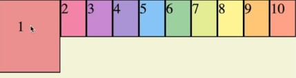
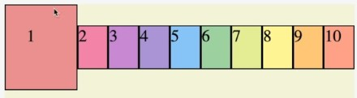

CSS
===
youtube클론코딩 : https://www.youtube.com/watch?v=67stn7Pu7s4
---
CSS Flex : https://www.youtube.com/watch?v=7neASrWEFEM
<hr>

#   CSS 모듈화
> ```
>   :root{
>       --text-color: #f0f4f5;
>       --background-color: #263343;
>       --white-color: #f0f4f5;
>   }
> ```
>css도 다른 언어와 마찬가지로 상단에 변수를 선언해주고 그 변수로 제어하면 유지보수에 편리함.(color , padding ...)
> 
> <br>      
>
> ```     
> header {
>    .logo {
>        
>    }
>    
>    .icons {
>
>    }
> }
> ```
>
> SASS&LESS 라이브러리를 쓰면  
> 위와 같이  헤더 안에
> 예쁘고 코드양을 줄여줄 수 있다.
>
> react를 쓰면 
> PostCSS를 써서 모듈화하면서 쓸 수있다.
>
>   <br>
>
> - 반응형 시 화면 크기에 따른 제어
> <pre><code>@media screen and (min-width:768px){}</code></pre>
>

<br>

# CSS 속성
> - css 텍스트 줄 수 고정  
> <code>-webkit-line-clamp</code> 속성 : 
>블록 컨테이너의 콘텐츠를 지정한 줄 수만큼으로 제한할 수 있는 속성  
>display 속성을 <code>-webkit-box</code> 또는 <code>-webkit-inline-box</code>로,  
>그리고 <code>-webkit-box-orient</code> 속성을 vertical로 설정한 경우에만 동작  
>단순히 요소의 줄 수만 제한하기 때문에  
><code>overflow: hidden</code> 속성과 함께 사용하면 요소를 넘치는 텍스트를 감출 수 있다.
>
>- 키워드 값   
> <pre><code>-webkit-line-clamp: none;</code></pre>
>
>
>- `<integer>` 값  
> <pre>-webkit-line-clamp: 3;
> -webkit-line-clamp: 10;</pre>
>
>- 전역 값 
> <pre>-webkit-line-clamp: inherit;
> -webkit-line-clamp: initial;
>-webkit-line-clamp: unset;</-webkit-line-clamp:></pre>
>
>
> - TODO: ?
> <pre>
>.wrap {
>  width: 50px;
>}
>
>.ellipsis {
>    display: -webkit-box;
>    overflow: hidden;
>    text-overflow: ellipsis;
>    -webkit-box-orient: vertical;
>    -webkit-line-clamp: 2;
>}
></pre>
>
> <br>
> 
>주의사항    
>
>영어문자 같은 경우 공백으로 구분되지 않은 문자의 경우 줄바꿈이 생기지 않기 때문에 
> <code> word-break: break-all;</code>
> 속성과 함께 사용하는 것이 좋다.
>한 줄 말줄임 처리를 할 때 <code> -webkit-line-clamp</code> 속성과
><code>text-align: right </code>을 사용할 경우 폰트에 따라 말줄임 표시(...)가 나타나지 않을 때가 있는데 이를 방지하기 위해 단순히 한 줄 말처리를 위한 속성을 사용하는 것이 좋다.
> <pre>
>.ellipsis {
>  overflow: hidden;
>  text-overflow: ellipsis;
>  white-space: nowrap;
>}
> </pre>

<br>


# CSS 기본기
> div 태그와 같은 **시맨틱(?)태그**들은 안에 내용이 없으면 `display:none;` 상태와 같이 된다.   
> 따라서 backbround-color든 뭐든 아무것도 되지 않는다.
>
> `height:100%`와 `height:100vh` 확실히 다른데
> - 100% : element의 크기의 100%인 반면
> - 100vh : 보이는 화면상의 100%이다.  
>
> 예를 들어, 보여지는 엘리먼트가 최대화면보다 작을경우 모든 화면을 포함하지 못한다.
>  100vh은 부모의 크기와 상관없이 작동한다.
>  
> --- 
>
> ### `display: flex` : 해당 요소가 flex 요소가 된다.
>  
> #### flex는 대부분에서 지원하지만 몇몇 새로나온 속성값들은 지원이 안되는 브라우저도 많으므로 충분히 알아보고 사용할것.
> 
> - 요소의 정렬 방향   
> `flex-direction: row` : 왼쪽에서 오른쪽으로(기본값)  
> `flex-direction: row-reverse` : 오른쪽에서 왼쪽으로   
> `flex-direction: column` : 위에서 아래로  
> `flex-direction: column-reverse` : 아래에서 위로  
> 
> <br>
>
> - 요소의 줄(block) 제한  
>  `flex-wrap: nowrap` : 요소들이 한 줄(block)을 내려가지 않는다.{ width로 지정한 값보다 더 작아지기도함 } (기본값)  
> `flex-wrap: wrap` : 요소들이 정해진 크기보다 작아질 때 다음 줄로 내려감   
> `flex-wrap: wrap-reverse` : 요소들이 wrap 방향이 반대로 된다.
>
> #### `flex-flow: column nowrap` 과 같이 한 번에 방향과 래핑여부를 쓰는 것도 가능!
>
> <br>
>
>  - 중심축 기준으로 아이템 배치(요소들의 아이템들을 정렬)   
> `justify-content: flex-start` : X축이 중심축이라면 왼쪽에서 오른쪽으로 Y축이 중심축이라면 위에서 아래로 정렬(기본값)   
>  `justify-content: flex-end` : start와 반대로    
> `justify-content: center` : 가운데정렬  
> `justify-content: space-around` : 각 내부 아이템들에게 상하좌우에 동일한 크기의 여백을 넣어줌   
> `justify-content: space-evenly` : `space-around`가 row 기준으로 가장 왼쪽요소와 가장 오른쪽 요소들의 여백이 한 개의 요소로 생기는 여백이라서 다른 여백들보다 좀 좁았다면 모든 여백을 동일한 크기로 줌????    
> `justify-content: space-between` : row 기준으로 왼쪽과 오른쪽을 딱 맞게 붙이고 나머지 요소들 간격에 여백
> 
> #### `justify-content`는 `reverse` 와 달리 아이템의 순서가 역전되는 것은 아님(워드 왼쪽정렬/오른쪽 정렬 느낌)
> 
> - 중심축과 다른축 기준으로 아이템 배치   
>   
> 
>`align-items:baseline` : 위와같이 아이템1에 padding이 있어서 텍스트의 위치가 안맞게 되었을떄 텍스트를 균등하게 해준다.  
> `align-content:space-between` : 중심축과 다른 축 기준 양옆으로 컨텐츠를 딱 맞게 붙이고 나머지 요소들 간격에 여백(`justify-content`의 기능을 같고 기준축만 달라진다.)   
>
> ---
> ### 아이템에 쓰는 속성값들 
> - 아이템의 순서   
>  `order: 1` : 명령어로 요소들의 순서를 바꿀 수도 있도 있음(order를 지정해주지 않은 애들이 우선순위가 먼저 인것 같음.)   [실제 html구조가 변하는 것은 아님 / 시각적으로만 순서 변경]
>
> - 아이템이 컨테이너에서 차지할 비율?   
> `flex-basis: 60%` : 컨테이너에서 기본적으로 그 요소 차지할 비율을 결정지음.(기본값 : auto)  
> `flex-grow: 1` : 해당 요소가 컨테이너의 크기가 커졌을때 컨테이너를 채우려는 정도? / 컨테이너의 크기에 따라 자신의 고유한 사이즈를 넘어나게 할 수있음(기본값:0)   
>  `flex-shrink: 1` :  해당 요소가 컨테이너의 크기가 작아졌을때 컨테이너를 채우려는 정도? / 컨테이너의 크기에 따라 자신의 고유한 사이즈를 넘어나게 할 수있음(기본값:0)  
> #### `flex: 1 1 50%` : 이런식으로 표현도 가능함
>    `flex:1` 만 쓸 경우 자동으로 basis:0%
>  ##### `flex-grow`와`flex-shrink`로 컨테이너가 크거나 작아질때 각 요소들이 어떻게 변화할지 비율을 결정 지을 수 있음.
>
> <br>
>
> `align-self : center` : align-content의 요소버전 이 아이템 하나만 특별하게 배치할 수 있음


<br>


# CSS Gird
>  
> 1. <code>flex</code> 등장  
> 과거에 많이 레이아웃을 잡기위해 많이 쓰던   
> <code>float</code>의 본래 목적은 컨텐츠 내에서 이미지와 텍스트의 레이아웃을 잡는 목적이었다.  
> 하지만 BOX의 레이아웃을 잡을만한 기능이 없었기 때문에,  
> <code>float</code> 을 이용해서 그 일을 하였고   
> 그렇기 때문에 레이아웃을 구성하는데 매우 불편하고 시간이 오래 걸리고 유연함이 떨어지고 불가능한 레이아웃 또한 유지보수에도 좋지 않았다.
> 
> 여기서! <code>flex</code>가 등장하게 되는데
> <code>flex</code>를 통해서 Gird를 할 수 있다(?)   
> 
> ---
> 2. <code>flex</code>의 속성   
> - **container**에 적용할 수있는 flex의 속성  
> <code>display</code> :  
> <code>flex-direction</code> :  
> <code>flex-wrap</code> :   
> <code>flex-flow</code> :    
> <code>justify-content</code> :  
> <code>align-items</code> :  
> <code>flex-content</code> :  
>
> <br>
>
> - container내의 **item**에 적용할 수있는 flex의 속성  
> <code>order</code> :  
> <code>flex-grow</code> :  
> <code>flex-shrink</code> :  
> <code>flex</code> :    
> <code>align-self</code> : 
>
>
>  ---
> 3. <code>flex</code>의 중심축 개념(?)  
>  <code>element</code> 들을 가로(X축)를 기준으로 혹은 세로(Y축)을 기준으로 나열하게 되는 중심축 개념이 있다.   
> 


<br>

연습을 통해 익히는게 가장 좋음.
---