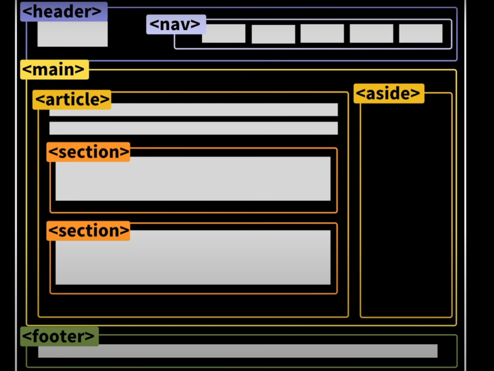

HTML
===
youtube클론코딩 : https://www.youtube.com/watch?v=67stn7Pu7s4
---
HTML 기초 : https://www.youtube.com/watch?v=OoA70D2TE0A&list=PLv2d7VI9OotQ1F92Jp9Ce7ovHEsuRQB3Y&index=6
---
헷갈리는 태그 : https://www.youtube.com/watch?v=T7h8O7dpJIg
---

<hr>

>  - HTML 파일에서는 되도록 정보만 담도록한다.  
> 제어문(JS같은)은 따로 작성하는 것이 로드/유지보수에도 좋다.  
> - HTML emmet : (알고있던 거지만)  
> <pre>태그명(.클래스명)>자식엘리먼트${엘리먼트에 들어갈 텍스트}*반복할 횟수  </pre>
> 띄워쓰기하면 안됨
> 
> 예시
> <pre>
>   div.container>div.item.item${content$}*10^div.container2>div.itemSE.item$+ul
> </pre>
> 결과   
> ```
>   <div class="container">
>        <div class="item item1">content1</div>
>        <div class="item item2">content2</div>
>        <div class="item item3">content3</div>
>        <div class="item item4">content4</div>
>        <div class="item item5">content5</div>
>        <div class="item item6">content6</div>
>        <div class="item item7">content7</div>
>        <div class="item item8">content8</div>
>        <div class="item item9">content9</div>
>        <div class="item item10">content10</div>
>   </div>
>   <div class="container2">
>        <div class="itemSE item1"></div>
>        <div class="itemSE item2"></div>
>        <div class="itemSE item3"></div>
>        <div class="itemSE item4"></div>
>        <div class="itemSE item5"></div>
>       <ul></ul>
>   </div>
>```
>
> <br>
>
> <pre>태그명(.클래스명)>자식엘리먼트${엘리먼트에 들어갈 텍스트}*반복할 횟수  </pre>

<hr>

# HTML 기초

> - Box vs Item   
> Box : 내부 컨텐츠가 없으면 사용자에게 보여지지 않음  
> `header` `section` `footer` `article` `nav` `div` `aside` `span` `main` `form`     
> <br>
> Item :  `a` `button` `input` `label` `img` `video` `audio` `map` `canvas` `table` 
>
> - Block vs Inline  
> Block : 한 블럭(줄)을 차지하는 요소  
> `div` `p`  ...  
> Inline : 한 줄에 표현되는 요소 / 공간이 허용하면  
> `span`   ...
>
> - Attribute란  
> 요소들이 가지는 특성 혹은 기능을 표현할 수있는 속성
>

---
# 헷갈리는 태그
> - Semantic tags  
>  시맨틱 태그 사용이 중요한점  
>   SEO(Search Engine OPtimization) : 검색을 최적화 하기 위해서 
>   Accessibility : 웹사이트를 읽어주는 기능 등에서 잘 동작
>   For Developer : 가시성이 좋고 유지보수성을 더 높일 수있음
>
>  
>
>   `header` `nav` `main` `aside` `article` `section` `footer` 를 활용하여 레이아웃을 잘 잡을 수 있다.
>
> ### article vs section
> `article` : `main` 안에서 블로그에서 포스트 하나 , 신문기사의 기사 하나 등 하나 그 자체를 묶을때 사용(이 자체 하나를 보여줘도 문제가 없을때)  
> `section` : `main` 혹은 `article` 안에서 연관있는 정보를 묶어줄때 
> 
> 경우에따라 `section`안에 `article`이 들어갈 수도 있음.
>
> <br>
>
>  ### `i` , `b` vs `em` , `strong `
> `i` : 시각적으로만 _이택릭체_ 로 표기됨. (책의 제목 / 인용구..)  
> `b` : 시각적으로만  **볼드** 로 표기됨.  
> `em` : 시각적 _이택릭체_ + 강조하는 효과가 있음(스크린리더 등으로 읽었을때)    
> `strong` 시각적 **볼드** + 강조하는 효과가 있음(스크린리더 등으로 읽었을때)  
>
> ### `ol` vs `ul` vs `dl`
> `ol`(order list) + [`li`] : 순서가 있는 목록을 나타낼때 
> `ul`(unordered list) + [`li`] : 순서가 없는 목록을 나타낼때(단순히 목록으로만 나타낼때)  
> `dl`(description list) + [`dt` , `dd`] : 어떤 단어에 대해 설명 혹은 정의 하는 목록을 나타낼떄    
>
> ### `img` vs CSS `background-image`
> `img` : 이미지가 요소 안에서 하나의 중요한 다른 요소로 자리 잡고 있을때 
> CSS `background-image` : 이미지가 문서의 내용과는 별개로 스타일링 목적의 배경이미지로 사용될 경우 문서의 일부분이 아닐 경우  
>
>
> ### `button` vs `a`
> `button` : 사용자의 특정한 액션(리뷰, 추천, 로그인, 가입 ...)  
> `a` : 어디론가 이동할때(링크 )
>
> ### `table` vs CSS스타일링
> `table` : 많은 데이터를 행과 열을 이용해서 적절하게 나타낼떄(단순히 아이템을 Grid 형식으로 나타내기 위해서 X)   
>  CSS스타일링 : flex와 grid로 아름답게~  
>
>
>
