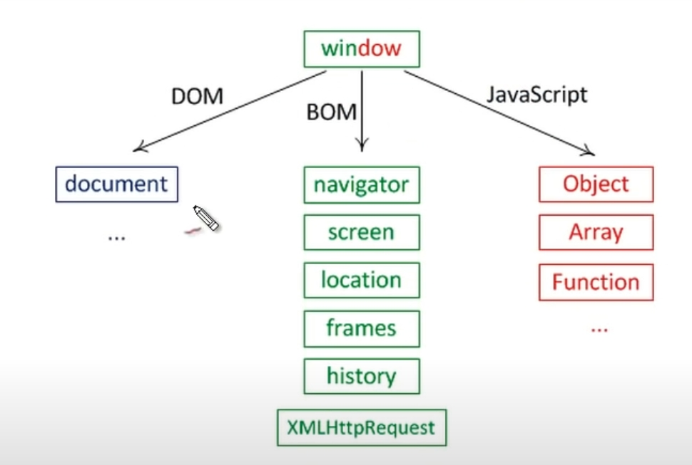

p JS 기초
 ===

- JS 파일을 불러올 위치의 중요성
> js 파일은 *body* 끝에서 불러오면 회면을 빠르게 먼저 로드해 줄 수있다.  
> 경우에 따라 js 파일을 *head* 에서 불러 올 수도 있음.  
>
> js에서 <code> document.getElementByID('');  </code>와 같은 메소드로 값을 받아올 때  
> *head*에서 불러올 경우 해당하는 ID 엘리먼트를 로드하지 못해 오류가 발생 할 수도 있다.  
>
> <code> window.onload = funection(){}</code>와 같이 작성하면 현재 html을 전부 로드한 후에 메소드를 호출 할 수있다.
>  
>HTML은 태그부터 빠르게 읽어서 객체를 미리 만들어둔다.
>
> - 기초상식  
> <code>var a = document.getElementsByTagName()</code>로 작성하면  
> a는 자동적으로 *배열* 이 된다.
> 

<br>
<br>

- ObjectModel : DOM / BOM / JavaScript Core   
> 
> 
>
> <code>window</code> 객체는  크게 2가지 의미를 가진다
>  1.  *전역객체*   
>  2.   window 또는 frame 과 같은 것을 제어하기 위한 객체
>
>  ---
>
> <code>window</code> 객체가 가지는 여러 *Property* 중에서   
> 아주 중요한 프로퍼티는 <code>document</code>이다.  
>
>  <code>window.document</code> 와 <code>document</code> 는 같은 의미이다.  
> 앞에 window를 써주지 않아도 window는 *전역객체* 이기 때문에 자동적으로 인식하게 된다.  
> 
> <code>document</code>객체는 *body* 등의 태그를 제어하는데 사용한다.   
> 즉, <code>Document</code>객체가 가진 기능은 *DOM*(Document Object Model) 이다
> 
> ---
>
> *BOM*(Brower Object Model) : 현재 이 웹페이지를 의미한다.  
> 현재 웹페이지가 가지고있는 URL을 알아낸다거나 Reload 혹은 Alert 할 수있는 기능을 가진 객체
>
> ---
>
>
> <code>Object</code>  <code>Array</code>  <code>Function</code> 과 같은 객체들을 가짐 
> 
> brower 를 제어하거나 GAS(Google Apps Script) 혹은 node.js와 같은 서버측 javasciprt 등.. 수많은 javasciprt등를 제어할 수 있음  
> 위의 GAS node.js 같은 환경들이  javascript를 통해 제어하기 때문
>

#### * DOM / BOM / JavaScript Core 의 각각의 객체들의 사용법을 알고 문제를 해결하는 것이 JavaScript 프로그래밍의 핵심

<br> 

---

<br>

- BOM

> 1. 사용자와 커뮤니케이션  
> <code> alert('')</code> : 경고창   
> <code> confirm('')</code> : 사용자의 응답에 따라 True/False값   
> <code> prompt('')</code> : 사용자의 입력 값  
>
> ---
>
> 2. Location객체  
>  <code>location.toString()</code>와 <code>location.href</code>는 같은 기능을 함(굳이 따지면 href가 더 잘 사용된다고 함)  
> <br>
> <code>console.log(location)</code> : location에 대한 정보를 출력       
> <code>alert(location)</code> : javascript가 location을 문자화 하여 url을 출력      
> <br>    
> <code>location.protocol</code> : 프로토콜 정보( ex. http )   
> <code>location.host</code> : 서비스 호스트 정보  
> <code>location.port</code> : 포트 정보 ( 아무것도 출력되지 않는다면 80포트 )  
> <code>location.pathname</code> : url에서 host정보를 뺀 나머지(?)  
> <code>location.search</code> : get방식으로 오는 정보 : ? 뒤로 오는 정보   
> <code>location.hash</code> : 문서안의 특정한 위치를 지정한 값에 대한 정보(?) : url 에서 # 뒤로 오는 정보 
>
> <br>
> <br>
> <br>
> 
>   #### <code>console.log()</code> 뿐만 아니라 <code>console.dir()</code> 로도 객체의 정보를 볼 수있다.
>  #### <code>console.dir(Navigator)</code>로 Navigator의 모든 *Property*를 볼수 있다.     
> 3. Navigator 객체  
> 브라우저의 정보를 제공하는 객체(주로 호환성을 위해 사용함)  
>  <br>
>    <code>location.appName</code>  
>    <code>location.appVersion</code>  
>    <code>location.userAgent</code> : 브라우저가 서버측으로 전송하는 user-agent http Header의 내용 /= appVersion과 비슷  
>    <code>location.platform</code>  : 현재 브라우저가 실행된 OS에 대한 정보
>
>
>
> - 기능테스트  
>  Navigator 객체는 브라우저 호환성을 위해서 주로 사용하지만 모든 브라우저에 대응하는 것은 쉬운 일이 아니므로 아래와 같이 기능 테스트를 사용하는 것이 더 선호되는 방법이다.   
>  예를 들어 <code>Object.keys</code>라는 메소드는 객체의 key 값을 배열로 리턴하는 Object의 메소드다. 이 메소드는 **ECMAScript5**에 추가되었기 때문에 오래된 자바스크립트와는 호환되지 않는다. 아래의 코드를 통해서 호환성을 맞출 수 있다. 
>```
> if (!Object.keys) {
>  Object.keys = (function () {
>    'use strict';
>    var hasOwnProperty = Object.prototype.hasOwnProperty,
>        hasDontEnumBug = !({toString: null}).propertyIsEnumerable('toString'),
>        dontEnums = [
>          'toString',
>          'toLocaleString',
>          'valueOf',
>          'hasOwnProperty',
>          'isPrototypeOf',
>          'propertyIsEnumerable',
>          'constructor'
>        ],
>        dontEnumsLength = dontEnums.length;
> 
>    return function (obj) {
>      if (typeof obj !== 'object' && (typeof obj !== 'function' || obj === null)) {
>        throw new TypeError('Object.keys called on non-object');
>      }
> 
>      var result = [], prop, i;
> 
>      for (prop in obj) {
>        if (hasOwnProperty.call(obj, prop)) {
>          result.push(prop);
>        }
>      }
> 
>      if (hasDontEnumBug) {
>        for (i = 0; i < dontEnumsLength; i++) {
>          if (hasOwnProperty.call(obj, dontEnums[i])) {
>            result.push(dontEnums[i]);
>          }
>        }
>      }
>      return result;
>    };
>  }());
>}
>```
>

---

